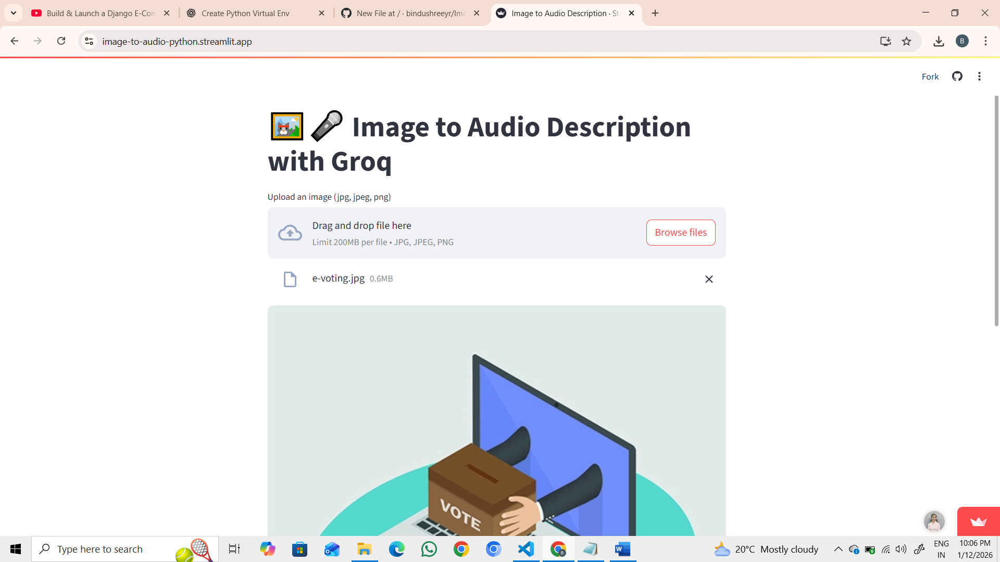
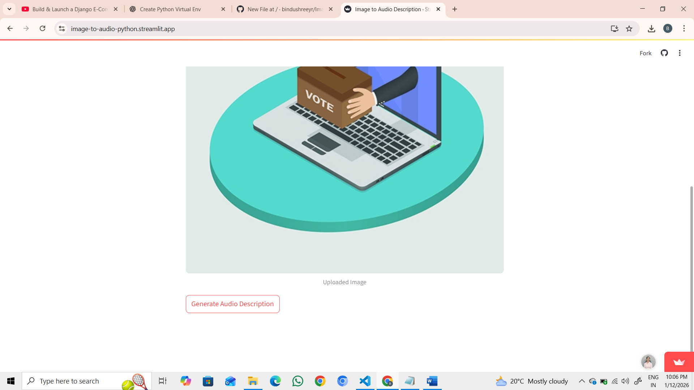
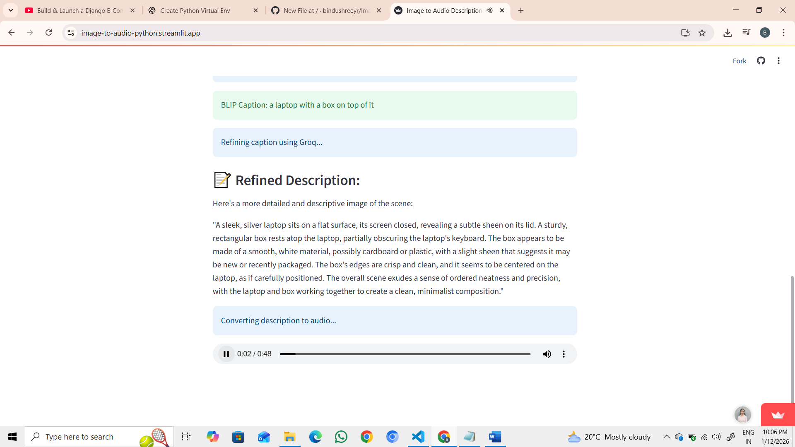

# 🖼️ Image to Audio Description App

An AI-powered Streamlit application that converts images into audio descriptions using
computer vision, large language models, and text-to-speech.

## 🚀 Live Demo
👉 https://your-app-name.streamlit.app

## 🧠 Overview
Users upload an image, the app generates a caption using BLIP, refines it with a Groq LLM,
and converts the result into audio narration.

## 🛠 Tech Stack
- Python
- Streamlit
- BLIP (Salesforce)
- Groq LLM
- gTTS
- Transformers

## 📸 Screenshots

